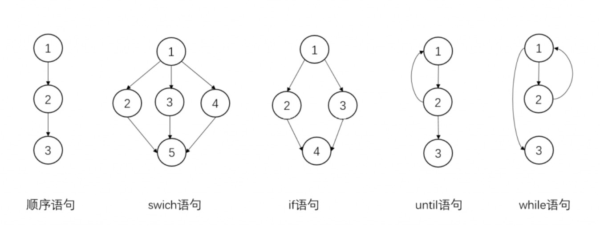
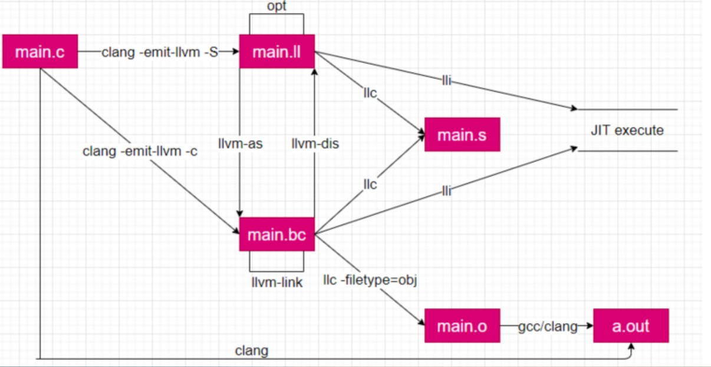
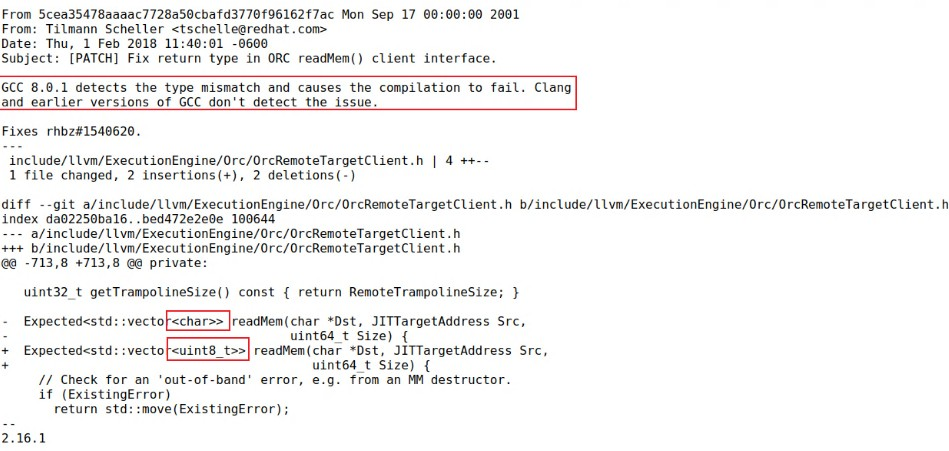

# llvm-learn
learn llvm ir pass and someothers if needed


## 一些编译选项
```bash
-enable-new-pm=0
-fno-discard-value-names
```
## LLVM IR

### @/% 意义
@ 全局变量符号
% 局部变量符号

```c
extern int a;
extern int b;

@a = external global i32, align 4
@b = external global i32, align 4

int a;
int b;
@a = global i32, align 4
@b = global i32, align 4

```


### IR 数据类型

i32 int32   int
i1  int1    bool


### 常用IR

```bash
alloca  : 分配栈空间变量
%retval = alloca i32, align 4

load    : 栈空间变量赋值，load a from b (<-)
%0 = load i32, ptr @a, align 4

store   : 栈空间变量赋值，store a to b (->)
store i32 %2, ptr %retval, align 4


cmp     : 比较指令
%cmp = icmp slt i32 %0, %1


br      : 跳转指令
（条件跳转）
br i1 %cmp, label %if.then, label %if.else

（无条件br)
 br label %return
```

## LLVM IR CFG (control flow graph)



## llvm tool-chains


### 探索LLVM生成的IR控制流

### IF CFG of LLVM IR
### IF-ELSE CFG of LLVM IR
### IF-ELSE-IF CFG of LLVM IR
### SWTICH CFG of LLVM IR
### FOR CFG of LLVM IR


## 实用链接
[控制流图（Control Flow Graph）-（CFG）](https://blog.csdn.net/qq_42052733/article/details/115923993)


## 问题记录
### llvm5 编译报错
